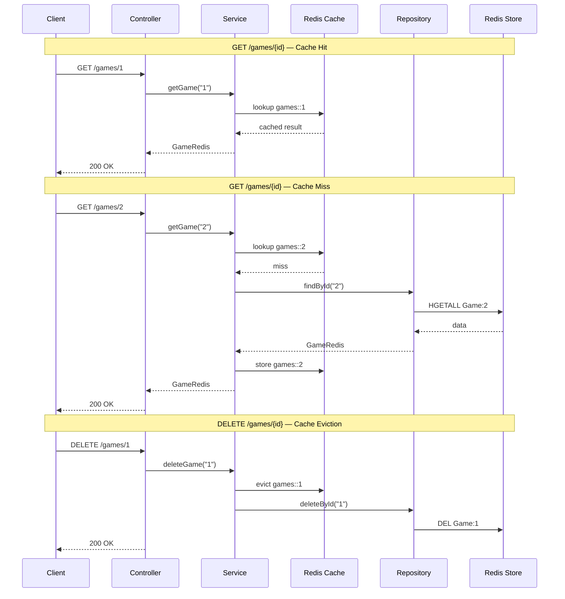

# Architecture Diagram

```mermaid
graph TB
    subgraph Clients
        HTTP["HTTP Clients"]
    end

    subgraph SpringBootApplication["Spring Boot Application"]
        subgraph Controllers
            URC["UserRedisController /users"]
            GRC["GameRedisController /games"]
        end

        subgraph Services
            URS["UserRedisService - Cacheable, CacheEvict, CachePut"]
            GRS["GameRedisService - Cacheable, CacheEvict"]
        end

        subgraph Repositories
            URR["UserRedisRepository - CrudRepository"]
            GRR["GameRedisRepository - CrudRepository"]
            UMR["UserMongoRepository - MongoRepository"]
            UMYSQLR["UserMysqlRepository - JpaRepository"]
        end

        subgraph Models
            subgraph RedisModels["Redis Models"]
                UR["UserRedis - RedisHash"]
                GR["GameRedis - RedisHash"]
            end
            subgraph MongoDBModels["MongoDB Models"]
                UM["UserMongo"]
                UPM["UserPartialMongo"]
            end
            subgraph MySQLModels["MySQL Models"]
                UMYSQL["UserMysql - JPA Entity, Persons table"]
            end
            subgraph DynamoDBModels["DynamoDB Models"]
                UDB["UserDB - DynamoDBTable"]
            end
        end

        subgraph Configuration
            RC["RedisConfig - LettuceConnectionFactory"]
            CM["RedisCacheManager - trackCache, customerCache, default"]
            TA["TutorialApplication - EnableCaching, EnableAsync"]
            AC["AppConfig - ComponentScan"]
        end

        subgraph Utilities
            UTIL["Util - Kafka TopicCreator, Randomizer"]
        end

        subgraph Resilience
            R4J["Resilience4j hello-retry - 3 attempts, exp backoff"]
        end

        subgraph OpenAPI
            OAG["OpenAPI Generator - Helloworld.yaml"]
        end
    end

    subgraph Infrastructure["Infrastructure - Docker"]
        REDIS[("Redis :6379")]
        REDIS_STACK[("Redis Stack UI :8001")]
        MONGO[("MongoDB :27017")]
        MYSQL[("MySQL 8.0 :3306 gogz DB")]
        DYNAMO[("DynamoDB Local :8000")]
        ZK["Zookeeper :2181"]
        KAFKA["Kafka :9092"]
    end

    HTTP --> URC
    HTTP --> GRC

    URC --> URS
    GRC --> GRS

    URS --> URR
    GRS --> GRR

    URR --> UR
    GRR --> GR
    UMR --> UM

    URS -.->|cache| CM
    GRS -.->|cache| CM

    RC --> REDIS
    CM --> REDIS
    URR --> REDIS
    GRR --> REDIS
    REDIS_STACK -.-> REDIS

    UMR --> MONGO
    UMYSQLR --> UMYSQL
    UMYSQLR --> MYSQL
    UDB -.-> DYNAMO

    UTIL --> KAFKA
    KAFKA --> ZK

```

## Data Flow

## Component Summary

| Layer | Component | Data Store | Port |
|-------|-----------|------------|------|
| Controller | UserRedisController `/users` | Redis | 6379 |
| Controller | GameRedisController `/games` | Redis | 6379 |
| Repository | UserMongoRepository | MongoDB | 27017 |
| Model | UserDB | DynamoDB Local | 8000 |
| Messaging | Util / Randomizer | Kafka | 9092 |
| Repository | UserMysqlRepository | MySQL | 3306 |
| Cache | trackCache (10min), customerCache (5min), default (60min) | Redis | 6379 |