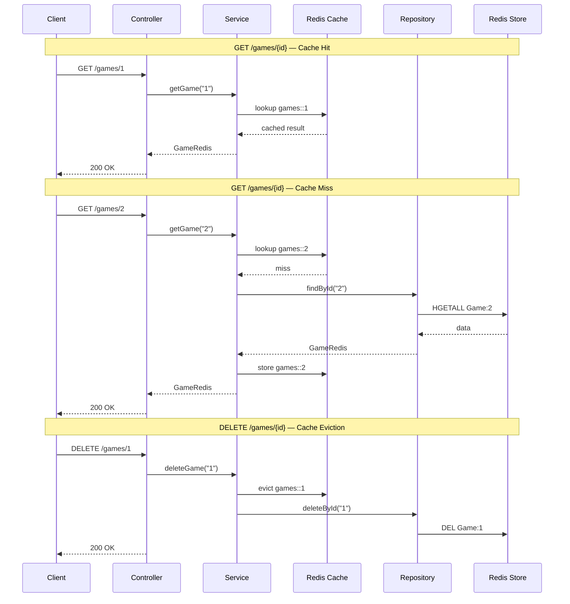

# Architecture Diagram

```mermaid
graph TB
    subgraph Clients
        HTTP[HTTP Clients]
    end

    subgraph Spring Boot Application
        subgraph Controllers
            URC[UserRedisController<br/>/users]
            GRC[GameRedisController<br/>/games]
        end

        subgraph Services
            URS[UserRedisService<br/>@Cacheable @CacheEvict @CachePut]
            GRS[GameRedisService<br/>@Cacheable @CacheEvict]
        end

        subgraph Repositories
            URR[UserRedisRepository<br/>CrudRepository]
            GRR[GameRedisRepository<br/>CrudRepository]
            UMR[UserMongoRepository<br/>MongoRepository]
        end

        subgraph Models
            subgraph Redis Models
                UR[UserRedis<br/>@RedisHash]
                GR[GameRedis<br/>@RedisHash]
            end
            subgraph MongoDB Models
                UM[UserMongo]
                UPM[UserPartialMongo]
            end
            subgraph DynamoDB Models
                UDB[UserDB<br/>@DynamoDBTable]
            end
        end

        subgraph Configuration
            RC[RedisConfig<br/>LettuceConnectionFactory]
            CM[RedisCacheManager<br/>trackCache · customerCache · default]
            TA[TutorialApplication<br/>@EnableCaching @EnableAsync]
            AC[AppConfig<br/>@ComponentScan]
        end

        subgraph Utilities
            UTIL[Util<br/>Kafka TopicCreator · Randomizer]
        end

        subgraph Resilience
            R4J[Resilience4j<br/>hello-retry<br/>3 attempts · exp backoff]
        end

        subgraph OpenAPI
            OAG[OpenAPI Generator<br/>Helloworld.yaml → build/gen/]
        end
    end

    subgraph Infrastructure - Docker
        REDIS[(Redis<br/>:6379)]
        REDIS_STACK[(Redis Stack UI<br/>:8001)]
        MONGO[(MongoDB<br/>:27017)]
        MYSQL[(MySQL 8.0<br/>:3306<br/>gogz DB)]
        DYNAMO[(DynamoDB Local<br/>:8000)]
        ZK[Zookeeper<br/>:2181]
        KAFKA[Kafka<br/>:9092]
    end

    HTTP --> URC
    HTTP --> GRC

    URC --> URS
    GRC --> GRS

    URS --> URR
    GRS --> GRR

    URR --> UR
    GRR --> GR
    UMR --> UM

    URS -.->|cache| CM
    GRS -.->|cache| CM

    RC --> REDIS
    CM --> REDIS
    URR --> REDIS
    GRR --> REDIS
    REDIS_STACK -.-> REDIS

    UMR --> MONGO
    UDB -.-> DYNAMO

    UTIL --> KAFKA
    KAFKA --> ZK

    MYSQL -.->|Persons table| MYSQL
```

## Data Flow



## Component Summary

| Layer | Component | Data Store | Port |
|-------|-----------|------------|------|
| Controller | UserRedisController `/users` | Redis | 6379 |
| Controller | GameRedisController `/games` | Redis | 6379 |
| Repository | UserMongoRepository | MongoDB | 27017 |
| Model | UserDB | DynamoDB Local | 8000 |
| Messaging | Util / Randomizer | Kafka | 9092 |
| Database | Persons table | MySQL | 3306 |
| Cache | trackCache (10min), customerCache (5min), default (60min) | Redis | 6379 |