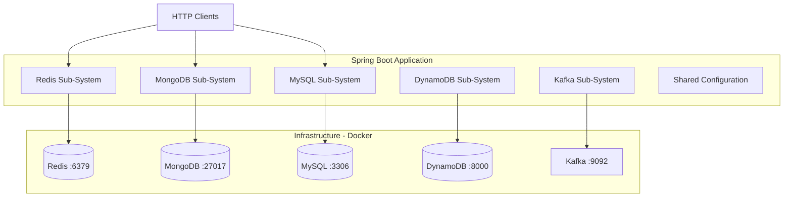
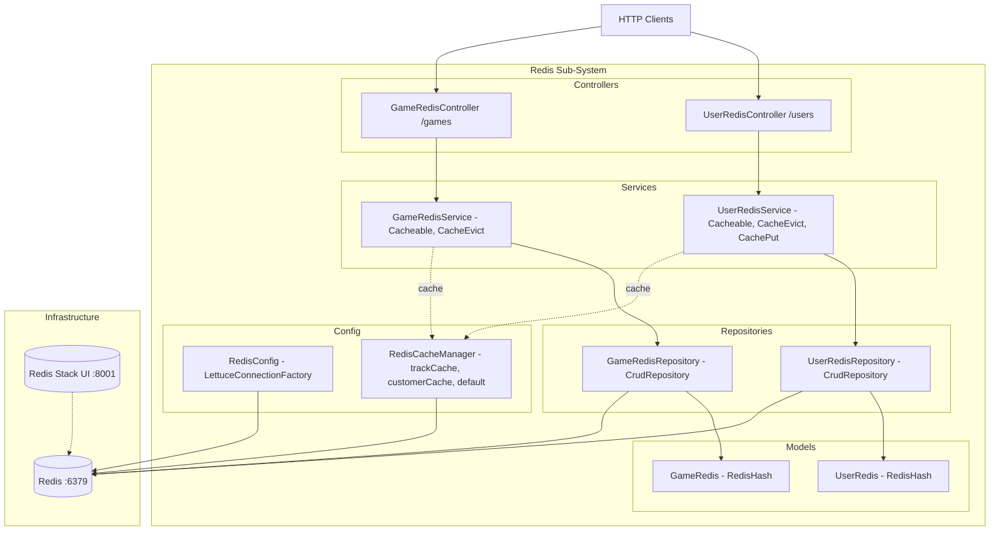
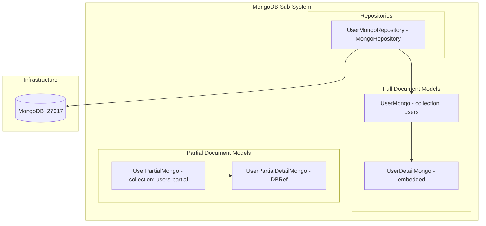
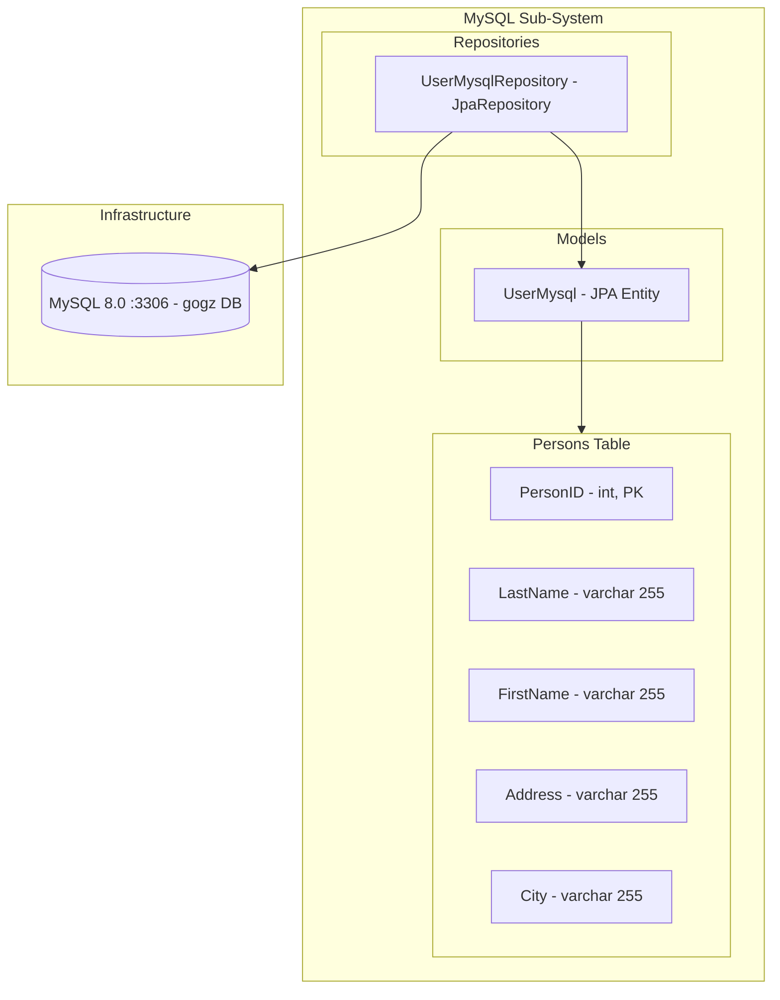
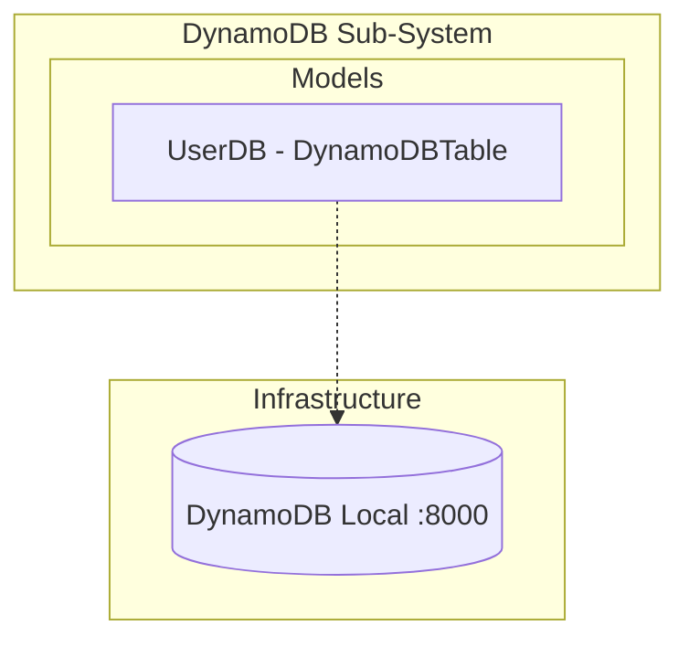
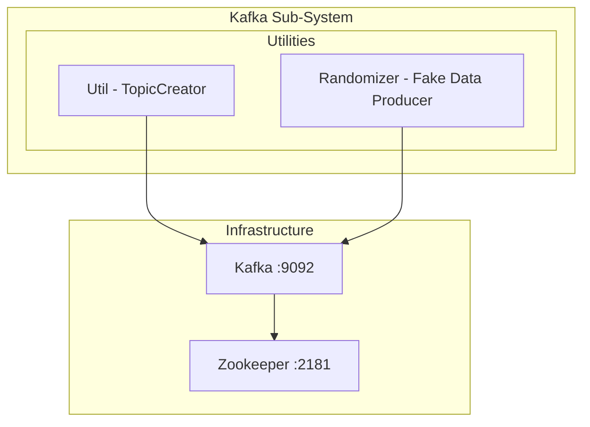
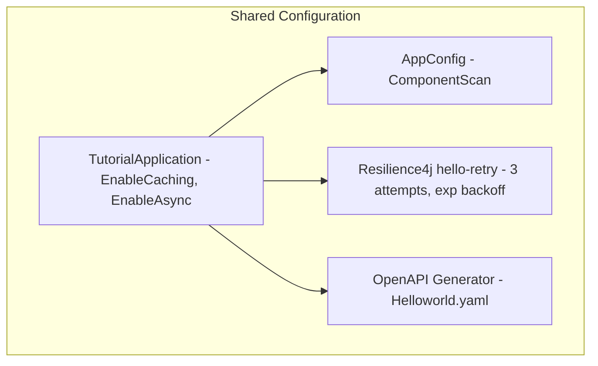
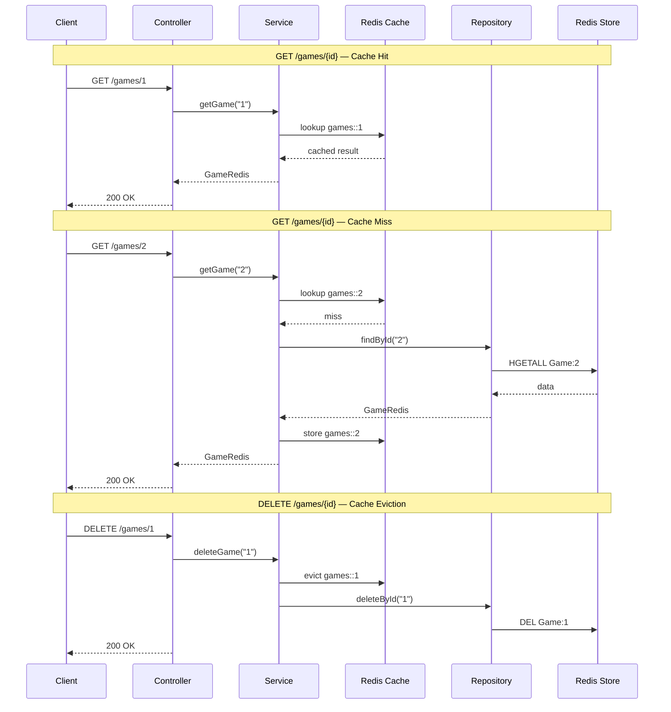

# Architecture Diagram

## High-Level Overview

---

## Redis Sub-System

---

## MongoDB Sub-System

---

## MySQL Sub-System

---

## DynamoDB Sub-System

---

## Kafka Sub-System

---

## Shared Configuration

---

## Data Flow - Redis Caching

---

## Component Summary

| Sub-System | Component | Data Store | Port |
|------------|-----------|------------|------|
| Redis | UserRedisController `/users` | Redis | 6379 |
| Redis | GameRedisController `/games` | Redis | 6379 |
| Redis | RedisCacheManager | Redis | 6379 |
| MongoDB | UserMongoRepository | MongoDB | 27017 |
| MySQL | UserMysqlRepository | MySQL | 3306 |
| DynamoDB | UserDB | DynamoDB Local | 8000 |
| Kafka | Util / Randomizer | Kafka | 9092 |
